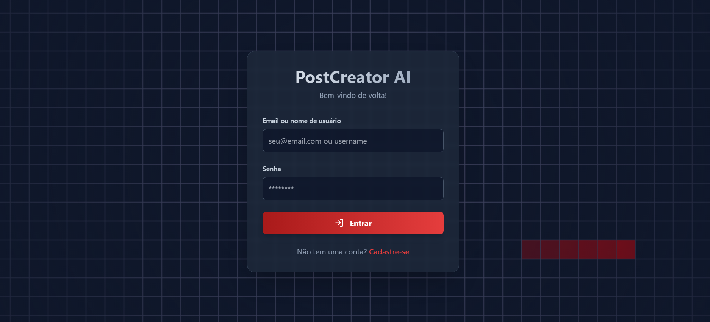
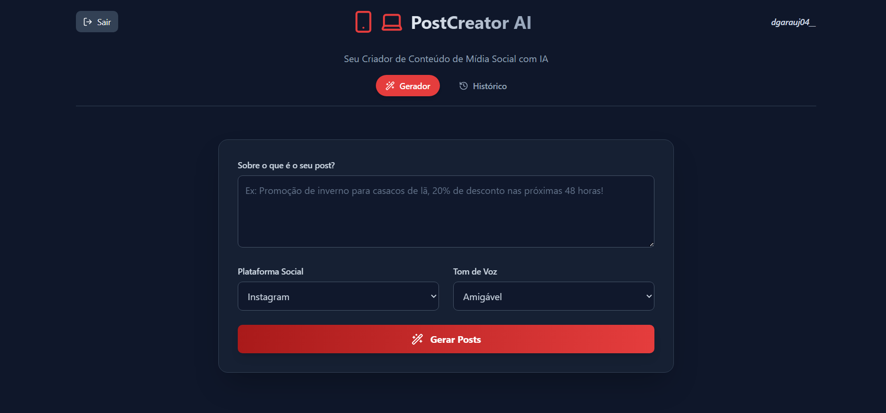
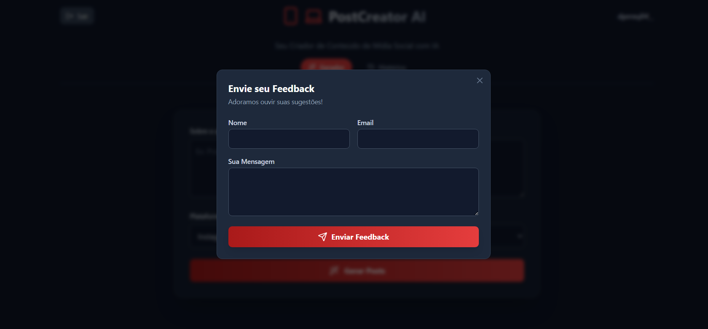

# PostCreator AI 🤖

O PostCreator AI é uma aplicação web full-stack projetada para automatizar e otimizar a criação de conteúdo para redes sociais usando inteligência artificial. A plataforma permite que os usuários se registrem, façam login e gerem posts de alta qualidade de forma rápida e intuitiva.

## 🖼️ Telas da Aplicação

<p align="center">
  <strong>Login</strong><br>
  <em>Tela de autenticação para os usuários acessarem suas contas.</em><br>
  
</p>

<p align="center">
  <strong>Página Inicial (Home)</strong><br>
  <em>Dashboard principal onde a mágica da criação de posts acontece.</em><br>
  
</p>

<p align="center">
  <strong>Feedback</strong><br>
  <em>Funcionalidade para coletar a opinião dos usuários e melhorar a plataforma.</em><br>
  
</p>

## ✨ Funcionalidades

- **Autenticação de Usuários**: Sistema seguro de registro e login com tokens JWT.
- **Criação de Posts com IA**: Geração de conteúdo otimizado para diversas plataformas.
- **Dashboard Intuitivo**: Interface moderna e fácil de usar para gerenciar e criar conteúdo.
- **Gerenciamento de Perfil**: Visualização e gerenciamento dos dados do usuário.
- **Design Responsivo**: Experiência de usuário consistente em desktops e dispositivos móveis.

## 🛠️ Tecnologias Utilizadas

O projeto é dividido em duas partes principais: o frontend e o backend.

### Frontend

- **React**: Biblioteca para construção da interface de usuário.
- **TypeScript**: Superset do JavaScript que adiciona tipagem estática.
- **Vite**: Ferramenta de build para um desenvolvimento frontend mais rápido.
- **React Router**: Para gerenciamento de rotas na aplicação.
- **Tailwind CSS**: Framework de CSS utility-first para estilização rápida e moderna.
- **Lucide React**: Pacote de ícones SVG.
- **Axios**: Cliente HTTP para realizar requisições à API.

### Backend

- **Python**: Linguagem de programação principal.
- **Flask**: Micro-framework web para construir a API.
- **MongoDB**: Banco de dados NoSQL para armazenar os dados da aplicação.
- **Flask-JWT-Extended**: Para gerenciamento de tokens de acesso JWT.
- **Flask-Bcrypt**: Para hashing de senhas.
- **Flask-PyMongo**: Integração entre Flask e MongoDB.

## 🚀 Como Executar o Projeto

Siga os passos abaixo para configurar e executar o projeto em seu ambiente local.

### Pré-requisitos

- **Node.js** (versão 18.x ou superior)
- **Python** (versão 3.8 ou superior)
- **MongoDB**: Um servidor MongoDB em execução (local ou em nuvem).

### 1. Clonar o Repositório

```bash
git clone https://github.com/seu-usuario/PostCreator-AI.git
cd PostCreator-AI
```

### 2. Configurar o Backend

```bash
# Navegue até a pasta do backend
cd backend

# Crie e ative um ambiente virtual
python -m venv venv
# No Windows:
venv\Scripts\activate
# No macOS/Linux:
source venv/bin/activate

# Instale as dependências
pip install -r requirements.txt

# Crie um arquivo .env e adicione as variáveis de ambiente
# (use o .env.example como base)
```

**Conteúdo do arquivo `backend/.env`:**
```env
MONGO_URI="sua_string_de_conexao_mongodb"
JWT_SECRET_KEY="sua_chave_secreta_super_segura"
```

**Inicie o servidor do backend:**
```bash
flask run
```
O servidor estará rodando em `http://127.0.0.1:5000`.

### 3. Configurar o Frontend

Abra um novo terminal.

```bash
# Navegue até a pasta do frontend
cd frontend

# Instale as dependências
npm install

# Crie um arquivo .env.local e adicione a URL da API
```

**Conteúdo do arquivo `frontend/.env.local`:**
```env
VITE_API_URL="http://127.0.0.1:5000"
```

**Inicie o servidor de desenvolvimento do frontend:**
```bash
npm run dev
```
A aplicação estará acessível em `http://localhost:5173` (ou outra porta indicada pelo Vite).

---

Feito por Douglas Araujo 